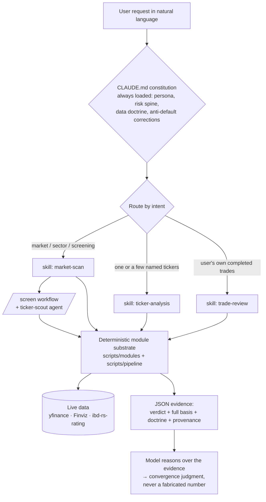

<p align="center">
  
</p>

<h1 align="center">Harness of Minervini</h1>

<p align="center">
  <em>A Claude Code harness that turns Claude into a disciplined Minervini SEPA momentum-stock analyst —<br>
  deterministic evidence, adjudicated doctrine, and judgment left where it belongs: with the model.</em>
</p>

<p align="center">
  <a href="LICENSE"></a>
  
  
  
  
</p>

---

## What this is

`ai-agent = ai-model + ai-harness`. A **harness** is the layer that gives a model capability and context without touching its judgment. This one makes Claude behave as a **conservative-aggressive momentum-stock analyst** in the tradition of Mark Minervini's SEPA (Specific Entry Point Analysis): it discovers candidate leaders, judges concrete buy/sell/hold timing on US equities, and — crucially — **grounds every precise number in deterministic code while leaving the final call to the model reasoning over that evidence.**

It is built for anyone who wants a rigorous, transparent, opinionated research assistant for US growth-stock momentum analysis — and as a **reference design** for how to encode an expert methodology into an LLM harness without flattening it into a brittle rulebook.

> [!IMPORTANT]
> **This is an analysis and education tool, not financial advice.** It never prescribes position sizes or portfolio allocations, it can be wrong, and markets can lose you money. Nothing here is a recommendation to buy or sell any security. You are solely responsible for your own decisions. See the [full disclaimer](#disclaimer) below. The **Minervini SEPA** and **TraderLion** methodologies are the intellectual property of their respective authors; this project paraphrases publicly-taught principles for interoperability and does not reproduce their books.

## Why it is different

Most "AI stock" tools do one of two things badly: they let the model hallucinate prices and fundamentals, or they hard-code a scoring formula and reduce the analyst to a rubber stamp. This harness refuses both.

- **Numbers are deterministic; judgment is the model's.** Prices, earnings, moving averages, relative strength, and dates come *only* from a suite of parameterized Python modules. The model never invents a market number, and on a data outage it says *unavailable* instead of guessing.
- **Every flag ships with its basis.** A gate verdict does not just say "7 of 8"; it carries *which* criterion failed and *by how much* (measured value vs. required threshold). A detector does not just say `distribution_pattern`; it exposes the measurements and a self-demoting label so the model interprets, rather than anchors on, the output. There is **deliberately no 0–100 master score** — a single number invites deference instead of reasoning.
- **Doctrine is adjudicated, not averaged.** Minervini's SEPA is the immutable constitution. TraderLion's practitioner tactics are admitted only as a tagged, subordinate practice layer, with 26 documented conflicts resolved Minervini-first. Every borrowed threshold carries a provenance tag (`[M]`, `[TL]`, `[TL-Kell]`, `[MM-*]`) so a practice-layer number can never masquerade as a hard gate.
- **The model works like a real trader.** It calls small, composable tools and *earns each deeper look* — a low-cost eligibility gate first, then entry structure, then fundamentals, then an exit plan — instead of firing one monolithic "analyze everything" command.

## What it can do

| You ask… | It routes to… | and it… |
|---|---|---|
| "How's the market? What's strong?" | `market-scan` | reads breadth + bottom-up leadership, calls a live regime verdict with refutation conditions, and builds a watchlist |
| "Is PLTR a buy? NVDA vs AMD?" | `ticker-analysis` | runs the Stage-2 + Trend-Template hard gate first, then earns entry/fundamentals/exit-plan convergence — per ticker |
| "Should I sell my NVDA position?" | `ticker-analysis` | reads the sell doctrine, runs the dated sell diagnostics, and returns SELL / HOLD-WITH-CONDITIONS / INCOMPLETE |
| "Grade my last 10 trades." | `trade-review` | scores each action /10, computes batting average, R-multiples, hold-time asymmetry, and the Loss Adjustment Exercise |
| `/screen AAPL MSFT …` | `/screen` workflow | fans out a regime → qualify → synthesize sweep into ranked PROCEED / watch / avoid buckets |

## Quickstart

**Requirements:** [Claude Code](https://claude.com/claude-code) (2.1.154+ for the `/screen` workflow), Python 3.10+, and internet access for live market data.

```bash
# 1. Clone
git clone https://github.com/tjdwls101010/Harness-of-Minervini.git
cd Harness-of-Minervini

# 2. Bootstrap the deterministic substrate (creates an ignored venv, installs pinned deps)
bash scripts/bootstrap.sh

# 3. Open the project in Claude Code and approve workspace trust.
#    Project permission rules (the narrow module allowlist) activate only after trust.
```

Then just ask, in natural language — Claude routes by intent:

```
How does the market look right now?
Is AVGO a buy here?
Should I hold or sell my CRWD position from $410?
/screen NVDA AMD AVGO --max-candidates 10
```

You can also drive the modules directly to see the raw deterministic evidence:

```bash
scripts/.venv/bin/python scripts/pipeline qualify AAPL
scripts/.venv/bin/python scripts/modules/vcp.py detect NVDA
scripts/.venv/bin/python scripts/modules/sell_signals.py cascade TSLA --start 2026-04-01
```

## How it works

The harness is a set of thin, purpose-built layers over the model, plus a deterministic code substrate the model calls into.



- **`CLAUDE.md`** carries the analyst *constitution* — the never-miss content (persona, risk spine, funnel order, the anti-default corrections, the two-tier doctrine, the data doctrine). It is the only channel loaded every session, so the model's discipline never rides on a skill triggering.
- **Three intent-split skills** — `market-scan`, `ticker-analysis`, `trade-review` — load their procedures and topic references on demand.
- **`ticker-scout` agent** isolates screening fan-out; the **`/screen` workflow** freezes the one fixed-shape orchestration.
- **The module substrate** (`scripts/`) is 16 parameterized CLI modules + a 2-command pipeline, each emitting one JSON document with its verdict, full basis, interpretation `doctrine`, and provenance tags. A transparent same-session cache keeps iterative re-analysis fast and reproducible.

A deeper tour lives in the **[Wiki](docs/wiki/README.md)**: [Architecture](docs/wiki/Architecture.md) · [The Minervini Method](docs/wiki/The-Minervini-Method.md) · [Design Principles](docs/wiki/Design-Principles.md) · [The Module Substrate](docs/wiki/The-Module-Substrate.md).

## Documentation

| Doc | What's in it |
|---|---|
| **[Wiki: Home](docs/wiki/README.md)** | Full guided documentation and navigation |
| [Installation](docs/wiki/Installation.md) | Setup, requirements, data sources, troubleshooting |
| [Quickstart](docs/wiki/Quickstart.md) | Your first analysis, worked example prompts |
| [Architecture](docs/wiki/Architecture.md) | Every harness layer and why it lives where it does |
| [The Minervini Method](docs/wiki/The-Minervini-Method.md) | SEPA, the Trend Template, VCP, the two-tier doctrine |
| [Skills & Usage](docs/wiki/Skills-and-Usage.md) | Each skill: triggers, procedure, example sessions |
| [The Module Substrate](docs/wiki/The-Module-Substrate.md) | The deterministic code, CLI contract, parameter iteration |
| [Design Principles](docs/wiki/Design-Principles.md) | The output-schema philosophy that makes this work |
| [Contributing & Extending](docs/wiki/Contributing-and-Extending.md) | Add a module, respect the contract, the v2 backlog |
| [FAQ & Disclaimer](docs/wiki/FAQ-and-Disclaimer.md) | Scope, limits, and the fine print |
| [CHANGELOG](CHANGELOG.md) | Release history |
| [CONTRIBUTING](CONTRIBUTING.md) | How to propose changes |

## Scope and boundaries

- **US-listed equities only**, on daily and weekly timeframes. Long or in cash — no shorts, no intraday tactics.
- **Analysis only.** It judges what to buy, when, and when to sell; it **never** prescribes portfolio percentages or position sizes.
- **Numbers from code, narrative from the web.** WebSearch is used only for current catalyst/company/industry context — never as a substitute for a market number.

## Disclaimer

This software is provided for **educational and informational purposes only**. It is **not** investment, financial, legal, or tax advice, and it is **not** a recommendation, solicitation, or offer to buy or sell any security. The authors are not licensed financial advisers. Market analysis is inherently uncertain; the deterministic outputs can be inaccurate, incomplete, or based on stale or erroneous third-party data, and the model's interpretations can be wrong. Trading and investing involve substantial risk of loss. **You are solely responsible for your own investment decisions and for any losses you incur.** Use at your own risk. The software is provided "AS IS", without warranty of any kind, as set out in the [LICENSE](LICENSE).

The **Minervini SEPA** methodology and the **TraderLion** materials referenced here are the intellectual property of their respective authors and organizations. This project independently paraphrases publicly-taught principles for the purpose of building an analysis tool; it does not reproduce, and is not affiliated with or endorsed by, Mark Minervini, TraderLion, or IBD.

## Credits

- **Mark Minervini** — *Trade Like a Stock Market Wizard* and the SEPA / Trend Template methodology that is this harness's constitution.
- **TraderLion** — the practitioner playbook that supplies the tagged, subordinate practice layer.
- Built with **[Claude Code](https://claude.com/claude-code)** and designed with the `harness-creator` methodology.

## License

Released under the [MIT License](LICENSE). The methodology content it paraphrases remains the intellectual property of its original authors, as noted in the disclaimer.
