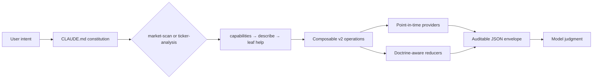

<p align="center"></p>

<h1 align="center">Harness of Minervini</h1>

<p align="center"><em>A principle-first Minervini SEPA analyst for Claude Code and Codex, backed by composable point-in-time evidence.</em></p>

<p align="center"><a href="LICENSE"></a>    </p>

## What this is

Harness of Minervini turns Claude Code or Codex into a disciplined US momentum-stock analyst grounded in Mark Minervini's SEPA method. It can assess the market, sector and industry leadership, discover promising common stocks and ADRs, analyze a named ticker's entry conditions, and evaluate HOLD or SELL evidence for an active position.

V2 is built around three ideas: principles guide judgment instead of a fixed workflow, the executable interface owns mechanical detail instead of repeating it across documents, and precise market claims carry source, as-of, completeness, and missing-evidence semantics. A ticker can end as `BUY-READY`, `WAIT`, `AVOID`, or `INCOMPLETE`; an active position can end as `HOLD`, `SELL`, or `INCOMPLETE`. Zero recommendations is a valid high-quality result.

> [!IMPORTANT]
> This is an analysis and education tool, not financial advice. It does not prescribe position sizes, portfolio weights, or asset allocation. Market data and model judgment can be wrong or incomplete, and you remain solely responsible for every investment decision. See [Disclaimer](#disclaimer).

## Scope

- US-exchange-listed common stocks and ADRs on completed daily and weekly bars; ETFs may provide market context but are not recommendations.
- Long or cash only. Shorts, options, crypto, OTC securities, SPACs and shells, non-US listings, and intraday strategies are outside scope.
- Market, sector, industry, candidate, prospective-entry, active-position, re-entry, peer, and chart analysis are in scope. Completed-trade grading and portfolio construction are not.
- Minervini eligibility and risk gates control. TraderLion contributes a tagged execution layer only where it does not conflict; early tactics remain explicit opt-ins.

## Quickstart

Requirements are Python 3.12+, internet access for live providers, and either Claude Code or Codex.

```bash
git clone https://github.com/tjdwls101010/Harness-of-Minervini.git
cd Harness-of-Minervini
bash scripts/bootstrap.sh
```

Filed fundamentals come from SEC EDGAR, which requires every automated caller to identify itself. Export your own name and email before asking for fundamentals; without it `ticker fundamentals` stops before making a request:

```bash
export MINERVINI_SEC_USER_AGENT='Your Name you@example.com'
```

Confirm the runtime can actually answer. `health` is offline and instant; `--probe` additionally makes one cheap request per probed provider and names any that cannot be reached:

```bash
scripts/.venv/bin/python scripts/pipeline health
scripts/.venv/bin/python scripts/pipeline health --probe
```

Open the repository in Claude Code or Codex and ask naturally:

```text
Which US sectors and industries look strongest, and which tickers deserve a closer look?
Analyze PLTR. Under exactly what conditions would it become buy-ready?
I own NVDA from $120 with a hard stop at $111. Should I hold or sell?
```

Claude and Codex load the same constitution and the same two intent-routed skills. `market-scan` handles market, group, leadership, discovery, and watchlist questions; `ticker-analysis` handles one or a few named tickers, entries, active positions, re-entry, peers, and charts.

## Discover the CLI just in time

The CLI is the authoritative usage document. Do not memorize or copy a command catalog; ask the interface what is available, inspect one selected contract, then read only that leaf command's detailed help.

```bash
scripts/.venv/bin/python scripts/pipeline capabilities
scripts/.venv/bin/python scripts/pipeline describe <capability>
scripts/.venv/bin/python scripts/pipeline <group> <command> --help
```

For example:

```bash
scripts/.venv/bin/python scripts/pipeline describe ticker.qualify
scripts/.venv/bin/python scripts/pipeline market snapshot --help
scripts/.venv/bin/python scripts/pipeline ticker risk --help
scripts/.venv/bin/python scripts/pipeline watchlist record --help
```

Every leaf `--help` explains its purpose, inputs, defaults, as-of behavior, provider and historical limitations, statuses, side effects, and examples. Every non-help command emits exactly one versioned JSON envelope. `status` describes evidence completeness—`ok`, `partial`, `unavailable`, or `needs_input`—rather than the investment verdict.

## How it works



The always-loaded constitution holds scope, immutable gates, risk discipline, data integrity, and response standards. The two compact skills contain task judgment without duplicating flags. The capability registry drives listing, description, detailed help, and 21 versioned schemas. Providers and pure reducers stay separate so transport failure, missing facts, deterministic failure, and qualitative ambiguity cannot collapse into one vague score.

Daily evidence defaults to the last completed US session. SEC facts must have been filed by the requested as-of boundary. Current mutable Nasdaq and Yahoo classification data is never relabeled as historical. The user's `ibd-rs-rating==0.5.0` package is the only cross-sectional RS source; the harness does not reproduce its formula or represent it as an official proprietary IBD feed.

Normal analysis is read-only apart from an ignored provider cache. Research state changes only through explicit `watchlist record`, `watchlist annotate`, or `watchlist export` requests. `ticker chart` discloses its ignored PNG and manifest artifacts in the response.

## Development

All v2 tests and fixtures live under `tests/`, in a dated directory per rewrite wave, and exercise public seams. The implementation plan records the full architecture and acceptance rationale at [docs/plans/260817/harness-v2-greenfield-plan.md](docs/plans/260817/harness-v2-greenfield-plan.md); the maintainers' non-runtime design record is `.claude/harness-spec.md`.

```bash
bash scripts/bootstrap.sh
scripts/.venv/bin/python -m unittest discover -s tests -p 'test_*.py'
scripts/.venv/bin/python -m compileall -q scripts/minervini scripts/pipeline
scripts/.venv/bin/python -m pip check
```

See [CONTRIBUTING.md](CONTRIBUTING.md) before changing doctrine, providers, capability contracts, or side effects. V1 is recoverable from the `harness-v1-final` tag; its runtime files are intentionally absent from the v2 branch.

## Disclaimer

This software is provided for educational and informational purposes only. It is not investment, financial, legal, or tax advice and is not a recommendation, solicitation, or offer to buy or sell any security. The authors are not licensed financial advisers. Market analysis is inherently uncertain; provider outputs can be stale, incomplete, revised, or wrong, and the model's interpretation can fail. Trading and investing involve substantial risk of loss. Use the software at your own risk under the terms of the [LICENSE](LICENSE).

The Minervini SEPA methodology and TraderLion materials remain the intellectual property of their respective authors and organizations. This independent project is not affiliated with or endorsed by Mark Minervini, TraderLion, Investor's Business Daily, Yahoo, Finviz, Nasdaq, or the SEC. See [NOTICE.md](NOTICE.md).

## License

Released under the [MIT License](LICENSE), which covers this repository's code and documentation only. Security issues should use [private vulnerability reporting](SECURITY.md).
